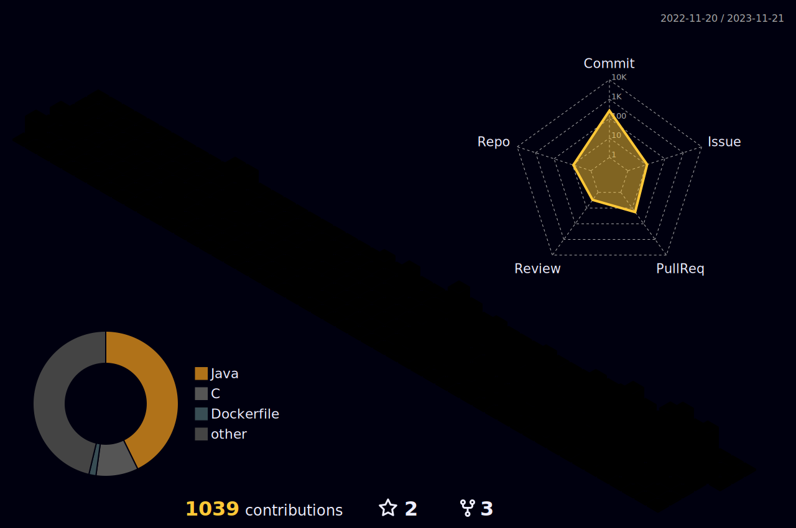

  

<h3 align="center">📊 Github Stats</h3>
<!--

  

    
  

  

    
  

    
    

-->

    
    
    
  

  

<h3 align="center">🌈 GitHub Contributions</h3>

  

<!--
### Hi there 👋

- 🔭 I’m currently working on ...
- 🌱 I’m currently learning ...
- 👯 I’m looking to collaborate on ...
- 🤔 I’m looking for help with ...
- 💬 Ask me about ...
- 📫 How to reach me: ...
- 😄 Pronouns: ...
- ⚡ Fun fact: ...
-->

